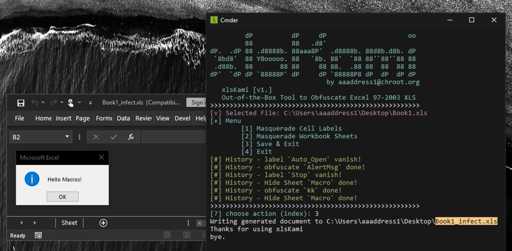

# xlsKami

Out-of-the-Box Tool to Obfuscate Excel 97-2003 XLS, rewrite from amazing [Macrome](https://github.com/michaelweber/Macrome), for easy to use by Red-Teams.

## Support Features
1. Cell Labels Obfuscation e.g. Auto_Open
2. Cell Labels **Super-Hidden**: total not able to unhide from Excel GUI
3. BoundSheet **Super-Hidden**:  total not able to unhide from Excel GUI too.

## Reference 
1. https://malware.pizza/2020/05/12/evading-av-with-excel-macros-and-biff8-xls/amp/?__twitter_impression=true
2. https://github.com/michaelweber/Macrome
3. https://github.com/outflanknl/EvilClippy
